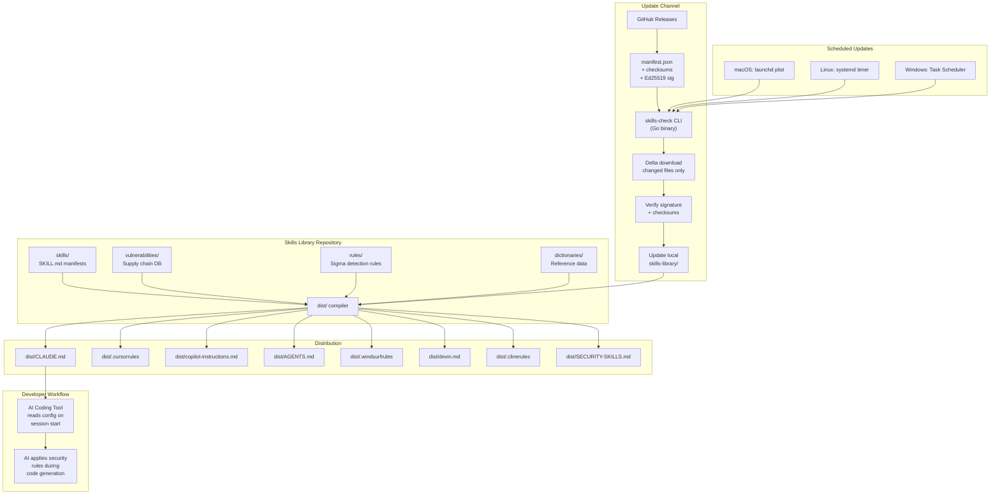
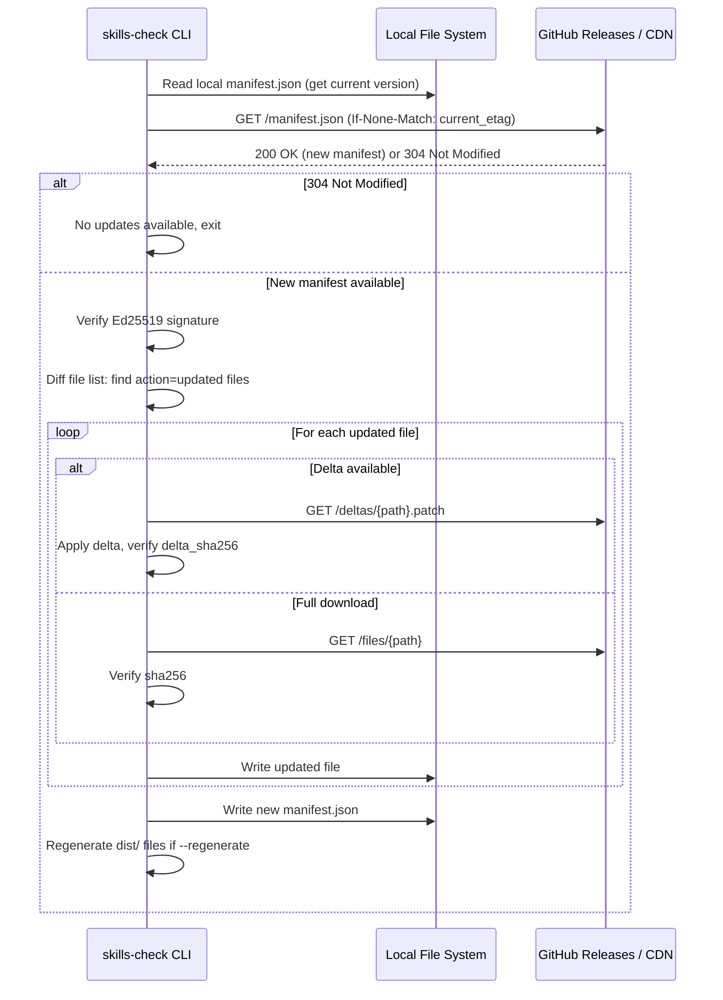

# Skills Library — Architecture

## System Overview



The diagram shows the four runtime subsystems and how the developer experience flows
through them:

- **Repository** — the canonical source of truth. Skills, vulnerability data, detection
  rules, and dictionaries are checked into Git. Everything is plain JSON / YAML /
  Markdown so PRs are reviewable.
- **Distribution** — the `dist/` compiler reads every input source and produces one
  IDE-specific file per supported tool. Each output is pinned to a token budget tier.
- **Update Channel** — signed releases on GitHub (or a self-hosted CDN) carry deltas
  forward to installed CLIs. The CLI verifies signatures before writing any file.
- **Scheduled Updates** — each OS uses its native scheduling mechanism; no daemons.

## `SKILL.md` Schema (Detailed)

The `SKILL.md` format is the contract between skill authors, the compiler, and the
validator. Every field is checked by `skills-check validate`.

### Frontmatter fields

| Field | Type | Required | Validation |
|-------|------|----------|------------|
| `id` | string | yes | kebab-case, unique across the library, matches directory name |
| `version` | string (semver) | yes | matches `^\d+\.\d+\.\d+$` |
| `title` | string | yes | < 80 chars |
| `description` | string | yes | 1 line, < 200 chars |
| `category` | enum | yes | one of `prevention`, `detection`, `compliance`, `supply-chain`, `hardening` |
| `severity` | enum | yes | one of `critical`, `high`, `medium`, `low` |
| `applies_to` | list of strings | yes | natural-language activation hints |
| `languages` | list of strings | yes | `["*"]` for language-agnostic, otherwise lowercase language identifiers |
| `token_budget` | object | yes | three integer fields: `minimal`, `compact`, `full` |
| `rules_path` | string | no | relative path to a directory of machine-readable rules |
| `tests_path` | string | no | relative path to a directory of test corpus files |
| `related_skills` | list of strings | no | other skill IDs |
| `last_updated` | string (ISO date) | yes | `YYYY-MM-DD` |
| `sources` | list of strings | yes | at least one external authoritative source |

### Body structure

The markdown body is divided into three named sections in this exact order:

1. **`## Rules (for AI agents)`** — the machine-consumable instructions. Subsections
   must include `### ALWAYS`, `### NEVER`, and `### KNOWN FALSE POSITIVES`. Bullets
   inside these subsections are what the compiler extracts for the `minimal` tier.
2. **`## Context (for humans)`** — rationale, background, and why this matters. This is
   included in the `full` tier and stripped in `compact` / `minimal`.
3. **`## References`** — links to rule files and external standards.

The strict section ordering means the compiler can extract each tier with a simple
markdown walker rather than re-parsing per skill.

## `dist/` Compiler Architecture

The compiler is a pure function from `(skills, vulnerabilities, dictionaries, tool,
budget)` to a single rendered file. Pseudocode for the per-target compilation loop:

```
For each target tool:
  1. Load all skills matching the selected skill set
  2. For each skill, extract the appropriate token_budget tier
  3. Apply tool-specific formatting:
     - CLAUDE.md: markdown with ## headers per skill
     - .cursorrules: flat instruction format
     - copilot-instructions.md: markdown with clear sections
     - AGENTS.md: agent-oriented instruction format
  4. Inject vulnerability database summary (top N critical items)
  5. Inject relevant dictionary entries inline (security terms the AI needs)
  6. Calculate total token count, warn if exceeding tool's effective limit
  7. Write to dist/{filename}
```

The tool-specific formatters live in `cmd/skills-check/internal/compiler/` and each
implements a small `Formatter` interface. Adding a new IDE tool means writing one
file: a new formatter plus a registration line.

## Manifest and Update Protocol

The wire format is a single JSON file plus optional delta patches. The signature is
over the entire JSON (excluding the `signature` field itself) using Ed25519 with the
embedded public key.

```json
{
  "schema_version": "1.0",
  "version": "2026.05.12.1",
  "previous_version": "2026.05.11.3",
  "released_at": "2026-05-12T10:30:00Z",
  "signature": "ed25519:<base64-encoded-signature>",
  "public_key_id": "skills-library-release-2026",
  "files": [
    {
      "path": "skills/secret-detection/SKILL.md",
      "sha256": "abc123...",
      "size": 2048,
      "action": "unchanged"
    },
    {
      "path": "vulnerabilities/supply-chain/malicious-packages/npm.json",
      "sha256": "def456...",
      "size": 45000,
      "action": "updated",
      "delta_from": "2026.05.11.3",
      "delta_sha256": "ghi789...",
      "delta_size": 1200
    }
  ]
}
```

### Update flow



Two safety properties hold across the flow:

- **Atomic writes.** Every file is written to a sibling temp path and `rename`d into
  place. A crash mid-update leaves the previous version intact.
- **Verify-before-replace.** Signature and per-file checksums are verified before any
  rule file is written. A bad signature aborts the entire update.

## CLI Architecture (`skills-check`)

The CLI is a single Cobra-based Go binary. Layout:

```
cmd/skills-check/
├── main.go                    # cobra root command
├── cmd/
│   ├── root.go                # root command + subcommand registration
│   ├── init.go                # skills-check init --tool <tool> --skills <list> --budget <tier>
│   ├── update.go              # skills-check update [--regenerate] (Phase 2)
│   ├── validate.go            # skills-check validate [--path <dir>]
│   ├── list.go                # skills-check list [--category <cat>]
│   ├── regenerate.go          # skills-check regenerate [--tool <tool>] [--budget <tier>]
│   ├── version.go             # skills-check version
│   └── cmd_test.go            # integration tests for every subcommand
├── internal/
│   ├── skill/                 # SKILL.md parser (YAML frontmatter + markdown body + tier extraction)
│   ├── token/                 # tiktoken-go counter + 1.3x Claude multiplier + budget enforcer
│   ├── compiler/              # dist/ file generators per tool + context loader
│   │   ├── compiler.go        # Core compile loop, formatter registry, token reporting
│   │   ├── context.go         # Vulnerability summary, glossary, ATT&CK injection
│   │   ├── claude.go          # CLAUDE.md formatter
│   │   ├── cursor.go          # .cursorrules formatter
│   │   ├── copilot.go         # copilot-instructions.md formatter
│   │   ├── agents.go          # AGENTS.md formatter (also serves codex)
│   │   ├── windsurf.go        # .windsurfrules formatter
│   │   ├── devin.go           # devin.md formatter (defaults to full tier)
│   │   ├── cline.go           # .clinerules formatter
│   │   └── universal.go       # SECURITY-SKILLS.md formatter
│   └── manifest/              # manifest.json reader (Phase 2 will add signature verifier + delta downloader)
```

In Phase 2 the layout grows a `scheduler/` package (launchd / systemd / Windows Task
Scheduler plumbing) and a `vuln/` package for query helpers; for Phase 1 those are
out of scope and the dist compiler reads the vulnerability files directly via
`internal/compiler/context.go`.

The binary is built with `-trimpath -ldflags "-s -w"` for reproducibility. The embedded
Ed25519 public key is injected at build time via `-X` ldflags so the same source tree
can be built against different signing keys for staging versus production.

## Scheduler Implementation Details

The scheduler subsystem produces native artifacts for each OS. The CLI does not run as
a long-lived process; the scheduler launches the CLI on its own.

### macOS (`launchd`)

```xml
<?xml version="1.0" encoding="UTF-8"?>
<!DOCTYPE plist PUBLIC "-//Apple//DTD PLIST 1.0//EN" "http://www.apple.com/DTDs/PropertyList-1.0.dtd">
<plist version="1.0">
<dict>
    <key>Label</key>
    <string>com.skills-library.update</string>
    <key>ProgramArguments</key>
    <array>
        <string>/usr/local/bin/skills-check</string>
        <string>update</string>
        <string>--regenerate</string>
        <string>--quiet</string>
    </array>
    <key>StartInterval</key>
    <integer>21600</integer>
    <key>StandardOutPath</key>
    <string>/tmp/skills-check-update.log</string>
    <key>StandardErrorPath</key>
    <string>/tmp/skills-check-update.log</string>
</dict>
</plist>
```

The plist is written to `~/Library/LaunchAgents/com.skills-library.update.plist` and
loaded via `launchctl load`. `StartInterval=21600` is six hours in seconds; the value
is parameterized by `--interval`.

### Linux (`systemd`)

```ini
# ~/.config/systemd/user/skills-check-update.service
[Unit]
Description=Skills Library Update

[Service]
Type=oneshot
ExecStart=/usr/local/bin/skills-check update --regenerate --quiet

# ~/.config/systemd/user/skills-check-update.timer
[Unit]
Description=Skills Library Update Timer

[Timer]
OnBootSec=5min
OnUnitActiveSec=6h

[Install]
WantedBy=timers.target
```

The pair is enabled via `systemctl --user enable --now skills-check-update.timer`.
User-scope systemd means no root involvement; the timer runs only while the user is
logged in, which matches the desktop-developer workflow.

### Windows (Task Scheduler)

Task Scheduler is driven via COM through `golang.org/x/sys/windows`. The created task:

- Task name: `SkillsLibraryUpdate`
- Trigger: repeat every six hours
- Action: `skills-check.exe update --regenerate --quiet`
- Run whether user is logged on or not (with stored credentials)
- Stop the task if it runs longer than 10 minutes (defensive cap against a stuck
  update)

## Vulnerability Database Schema

Every malicious-package file in `vulnerabilities/supply-chain/malicious-packages/`
shares this schema. Per-ecosystem files keep diffs small and let CI parallelize
validation.

```json
{
  "schema_version": "1.0",
  "ecosystem": "npm",
  "last_updated": "2026-05-12T10:00:00Z",
  "entries": [
    {
      "name": "event-stream",
      "versions_affected": ["3.3.6"],
      "type": "malicious_code",
      "severity": "critical",
      "discovered": "2018-11-26",
      "description": "Maintainer account compromised; malicious flatmap-stream dependency added to steal cryptocurrency wallets",
      "references": ["https://blog.npmjs.org/post/180565383195/details-about-the-event-stream-incident"],
      "indicators": ["flatmap-stream dependency"],
      "cve": "CVE-2018-16492",
      "attack_type": "maintainer_compromise"
    }
  ]
}
```

### Attack type taxonomy

The `attack_type` field is a closed enum so the AI can reason about the kind of
threat and act differently per category.

| `attack_type` | Description |
|---------------|-------------|
| `maintainer_compromise` | Legitimate maintainer's credentials stolen and used to publish a malicious version |
| `typosquat` | New package whose name is a slight misspelling of a popular one |
| `dependency_confusion` | Public package shadowing an internal name |
| `protestware` | Maintainer intentionally publishes destructive code for political reasons |
| `cryptominer` | Package mines cryptocurrency on install or runtime |
| `data_exfiltration` | Package exfiltrates secrets, files, or environment to a remote server |
| `backdoor` | Persistent remote-control or remote-code-execution capability |
| `install_script_abuse` | Malicious `postinstall` / `setup.py` / `build.rs` behavior |

## Token Counting

Token counts are computed at compile time so authors get fast feedback.

- **OpenAI-family models** — use `tiktoken` with the `cl100k_base` encoding (matches
  GPT-4 / GPT-4o family).
- **Claude-family models** — apply a conservative `1.3x` multiplier on the
  `cl100k_base` count. This consistently overestimates rather than underestimates, so
  budget checks are safe.
- **The compiler reports token counts for each generated `dist/` file**, including a
  per-skill breakdown.
- **Warning thresholds.** `> 4000` tokens for the `compact` tier or `> 8000` tokens for
  the `full` tier triggers a compiler warning. Going over the declared budget in the
  skill's frontmatter is a build error.

## Security of the Library Itself

Skills Library is itself a piece of security tooling. Its supply chain must be
defended.

- **All releases are Ed25519-signed.** The signing key is hardware-backed (YubiKey)
  and held by the release maintainer; CI does not have direct access to it.
- **CI runs `skills-check validate` on every PR.** Schema violations, broken token
  budgets, and missing references all block merge.
- **Vulnerability database entries require at least one external reference** (CVE,
  advisory URL, blog post). No anonymous "trust me" entries.
- **No PII in any data file.** No researcher emails, no reporter names, no internal
  ticket numbers. Public advisories only.
- **CLI binary is reproducibly built** (`go build -trimpath -ldflags "-s -w"`). The
  release pipeline publishes the SHA-256 of every binary alongside the release.
- **CLI never writes to any network destination.** All HTTP traffic is `GET`-only,
  fetching public release artifacts.
- **CLI never collects telemetry, analytics, or usage data.** There is no opt-in
  toggle; the code that would do this does not exist.
